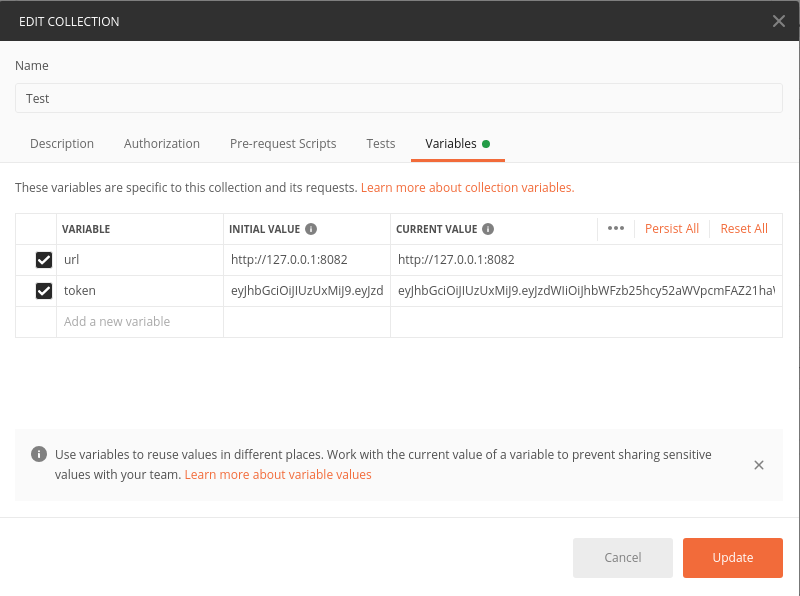
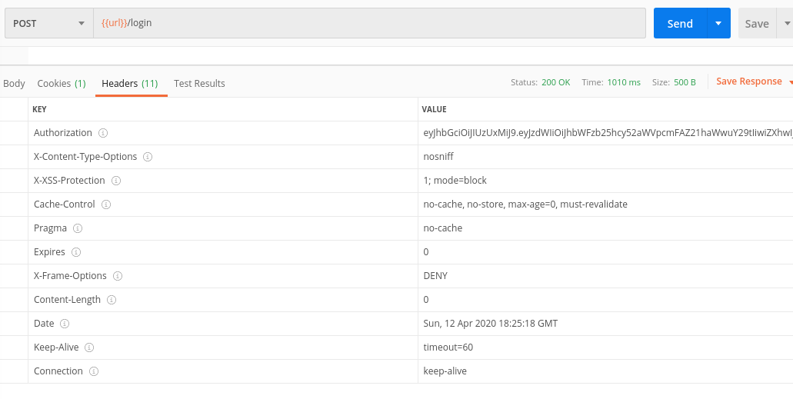
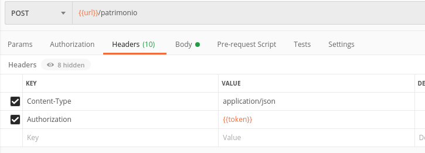

# Cadastro de patrimonios

Manual de integração da Api de cadastro de patrimonios

- [Cadastro de patrimonios](#cadastro-de-patrimonios)
    + [Instalação](#instala--o)
        * [Banco de dados](#banco-de-dados)
        * [Executar a aplicação](#executar-a-aplica--o)
    + [Postman](#postman)
    + [Autenticação](#autentica--o)
        * [Cadastro de novo usuário](#cadastro-de-novo-usu-rio)
        * [Login](#login)
    + [Marcas](#marcas)
        * [Criar](#criar)
        * [Editar](#editar)
        * [Excluir](#excluir)
        * [Listar todas as Marcas](#listar-todas-as-marcas)
    + [Patrimônios](#patrim-nios)
        * [Criar](#criar-1)
        * [Editar](#editar-1)
        * [Excluir](#excluir-1)
        * [Listar todos os patrimonios](#listar-todos-os-patrimonios)
        * [Busca de patrimônios por marca](#busca-de-patrim-nios-por-marca)
    + [Números irmãos](#n-meros-irm-os)


### Instalação

Antes de rodar a aplicação é necessário configurar o arquivo application.propperties, localizado no seguinte contexto do projeto:

```
{contexto}/src/main/resources/application.properties
```


A porta em que a aplicação estará disponível pode ser configurada alterando a seguinte linha do arquivo:

```
server.port=8082
```

##### Banco de dados

Caso deseje rodar no banco de dados embarcado (h2), basta descomentar as seguintes linhas do arquivo de propriedades:

```
#spring.datasource.url=jdbc:h2:mem:exam_database
#spring.datasource.driverClassName=org.h2.Driver
#spring.datasource.username=sa
#spring.jpa.database-platform=org.hibernate.dialect.H2Dialect
```

 E comentar estas linhas:

```
spring.datasource.url=jdbc:postgresql://172.19.0.2:5432/exam_navita
spring.datasource.username=postgres
spring.datasource.password=pg123
```

Caso queira utilizar uma instância do PostgreSQL, basta alterar as credênciais do segundo bloco para o contexto do seu ambiente

##### Executar a aplicação

Para executar a aplicação é necessário apenas ter o java na versão 1.8 e o Gradle configurado na máquina.

Tendo estes dois pré-requisitos, basta executar os seguintes comandos no contexto do projeto:

```
gradle build
gradle bootRun
```

Para parar a aplicação basta pressionar CTRL + C.


### Postman

Para facilitar a compreensão dos endpoints, este projeto conta com uma pasta para o software Postman, localizado na raiz deste projeto:

```
postman.json
```


Com o objetivo de facilitar a utilização do mesmo, defini algumas variáveis do projeto, para altera-las, basta editar a pasta e alterar as variáveis.





### Autenticação

##### Cadastro de novo usuário

Para ter acesso a api é necessário efetuar um login prévio para obter o token de autenticação.

Mas antes de efetuar o login, é necessário fazer o cadastro de usuários.

Usuários podem ser cadastrados na seguinte URL:

```
[HTTP.POST] http://{base-url}/usuario
```

Corpo da requisição:

```
{
	"nome":"Nome do usuário",
	"email":"exemplo@gmail.com",
	"ativo": true,
	"senha":"12345678"
}
```


* A senha deve ter no mínimo 6 dígitos

  

##### Login

Para efetuar login na aplicação, deve enviar uma requisição conforme o exemplo a seguir:

```
[HTTP.POST] http://{base-url}/usuario
```

```
{
	"nome":"exemplo@gmail.com",
	"senha":"12345678"
}
```

O token estará no cabeçalho de retorno da solicitação no atributo "Autorization"



Uma vez com o token de autorização for obtido, o mesmo deverá ser enviado em todas as requisições que serão apresentadas a seguir, conforme a imagem abaixo:



### Marcas

Endpoints para administração de marcas.

##### Criar

Endpoint para criação de um novo registro de marca:

```
[HTTP.POST] http://{base-url}/marca
```

Corpo da Requisição:

```
{
	"nome":"Chamex"
}
```

##### Editar

Endpoint para edição de um registro de marca:

```
[HTTP.PUT] http://{base-url}/marca/{marca.id}
```

Corpo da Requisição:

```
{
	"nome":"Chamex - novo nome"
}
```

##### Excluir

Endpoint para edição de um registro de marca:

```
[HTTP.DELETE] http://{base-url}/marca/{marca.id}
```

##### Listar todas as Marcas

Endpoint para consulta do registro de todas as marcas:

```
[HTTP.GET] http://{base-url}/marca
```


### Patrimônios

Endpoints para administração de itens de patrimônio.

##### Criar

Endpoint para criação de um novo registro de patrimônio:

```
[HTTP.POST] http://{base-url}/patrimonio
```

Corpo da Requisição:

```
{
	"marca": 1,
	"nome":"Caneta",
	"descricao":"Caneta Azul"
}
```

##### Editar

Endpoint para edição de um registro de patrimônio:

```
[HTTP.PUT] http://{base-url}/patrimonio/{patrimonio.id}
```

Corpo da Requisição:

```
{
	"marca": 1,
	"nome":"Caneta",
	"descricao":"Caneta Azul"
}
```

##### Excluir

Endpoint para edição de um registro de patrimônio:

```
[HTTP.DELETE] http://{base-url}/patrimonio/{patrimonio.id}
```

##### Listar todos os patrimonios

Endpoint para consulta do registro de todos os patrimônios:

```
[HTTP.GET] http://{base-url}/patrimonio
```

##### Busca de patrimônios por marca

Endpoint para consulta do registro de todos os patrimônios baseado em suas marcas:

```
[HTTP.GET] http://{base-url}/patrimonio/{patrimonio.id}
```

### Números irmãos

Para buscar um número irmão maior possível de um inteiro, basta envia-lo por parâmetro, conforme o seguinte exemplo:

```
[HTTP.GET] http://{base-url}/anagram_number/find_max/{numero}
```

*Para utilizar esta função não é necessária a autenticação